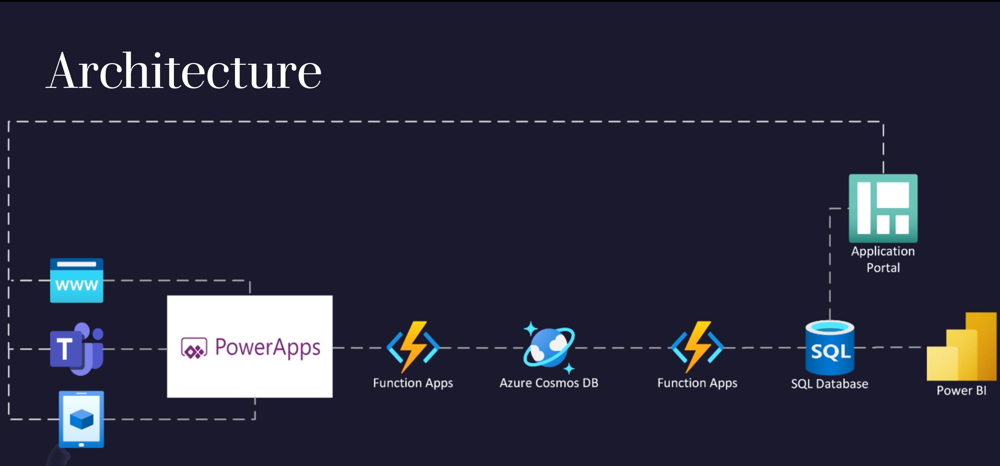

# Hybrid work management solution 

This reference architecture shows how to deploy an end-to-end hybrid work management application. It uses a  power apps app to book hybrid app and browser page for file/image for license plate ingestion, Azure Data Lake Storage to store the images, Azure Functions for serverless invocations, Azure Computer vision api (for this solution accelerator,) & CosmosDB to store the results.(PLACEHOLDER FOR POWERBI VISUALIZATION IF WE WANT). 

## Deploy

Before you hit the deploy button, make sure you review the details about the services deployed.

Once the resource deployed, you will need to deploy the functions to the Function App (at this time - could be further automated).

> **Important:** This deployment accelerator implements some service features that are still in Public Preview. Please consider those before you plan for a production deployment.
